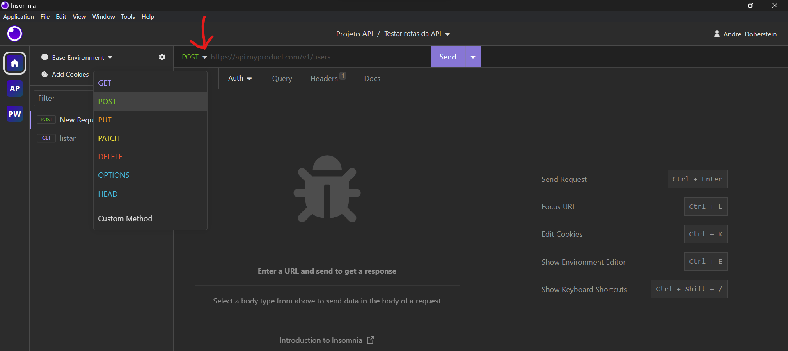
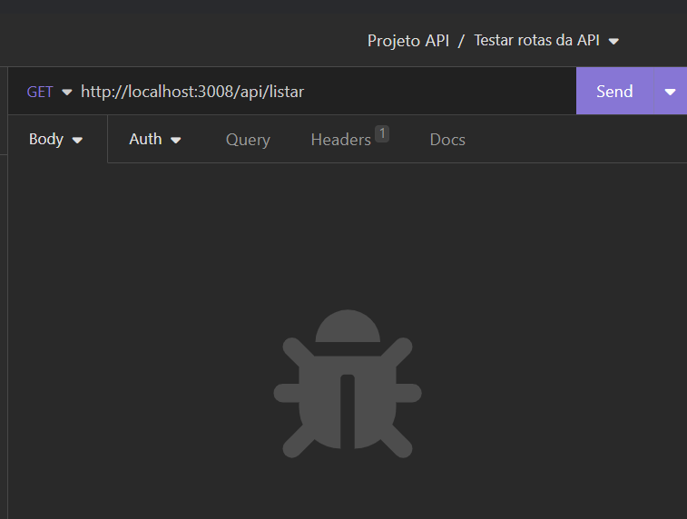

# Documentação
Copiar a url do projeto

Apagar pasta no PC

Para o repositório na sua máquina
```
git clone URL_REPOSITORIO
```
Acessar pasta
```
cd NOME_REPOSITORIO
```
Reinstalar os pacotes da aplicação
```
npm i
```
Abrir o VSCode
```
code .
```
Criar pasta . env e adicionar
```
PORT = 3000
```
Abrir Insomia

Clicar no "+" para criar novo projeto

New Collection

New HTTP Request

Renomear para cada método e alterar a tag


Para executar a ação da rota
```
npm start
```

Descrever a url da nossa API com a porta que definimos (http://localhost:3000) e as rotas (/api/listar - caso get) que criamos no arquivo rotas.js


Fazer o mesmo com os 3 métodos "PUT" "GET" "DELETE" "POST"